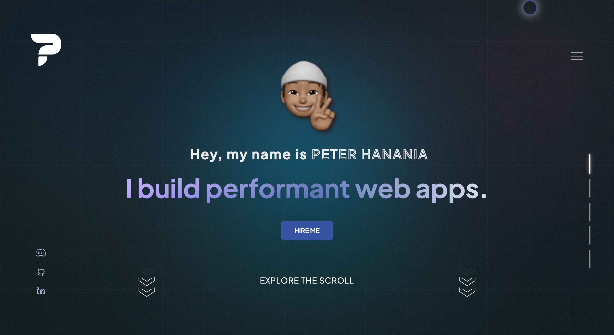
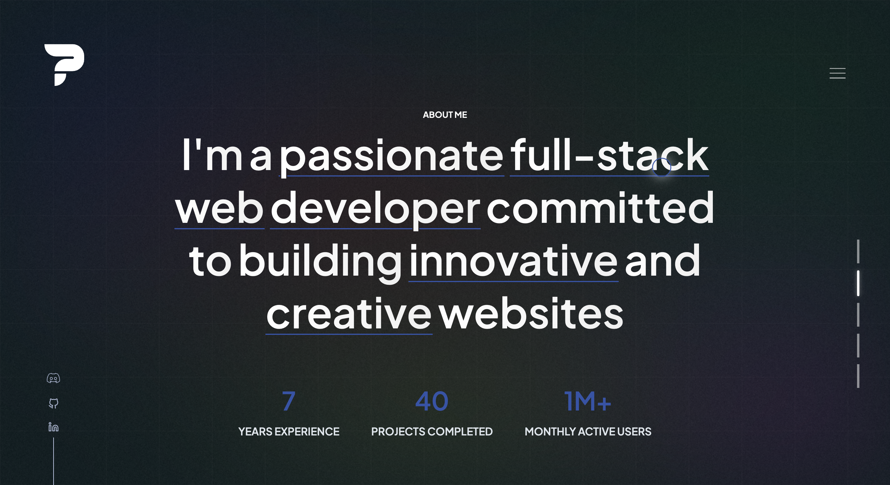
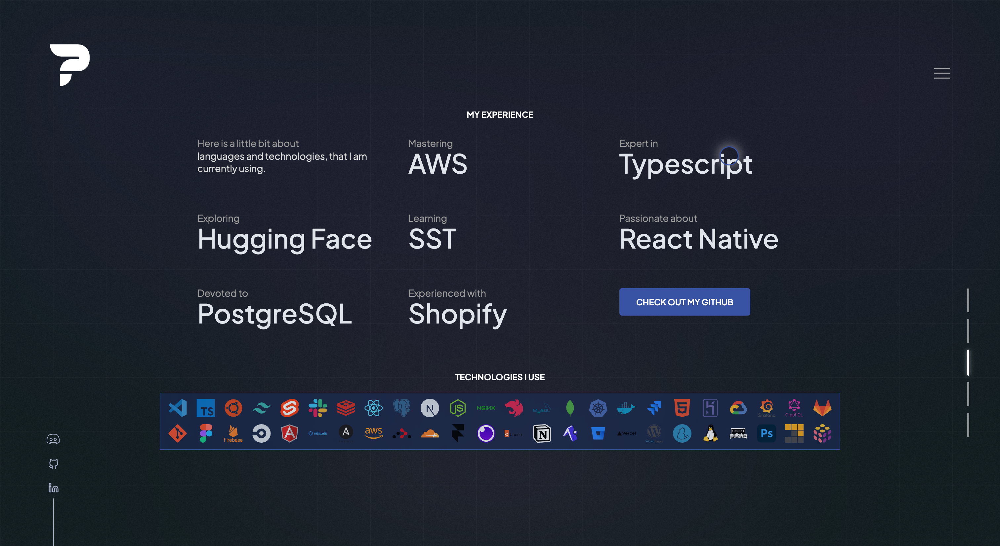
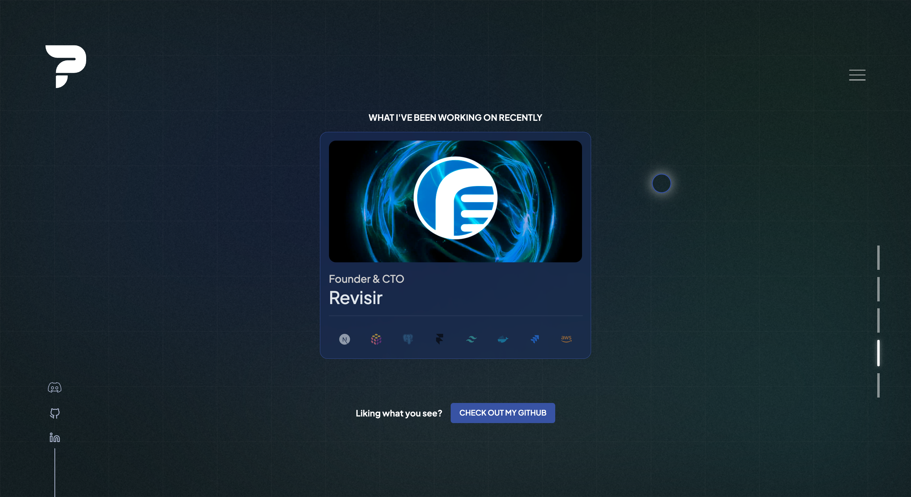
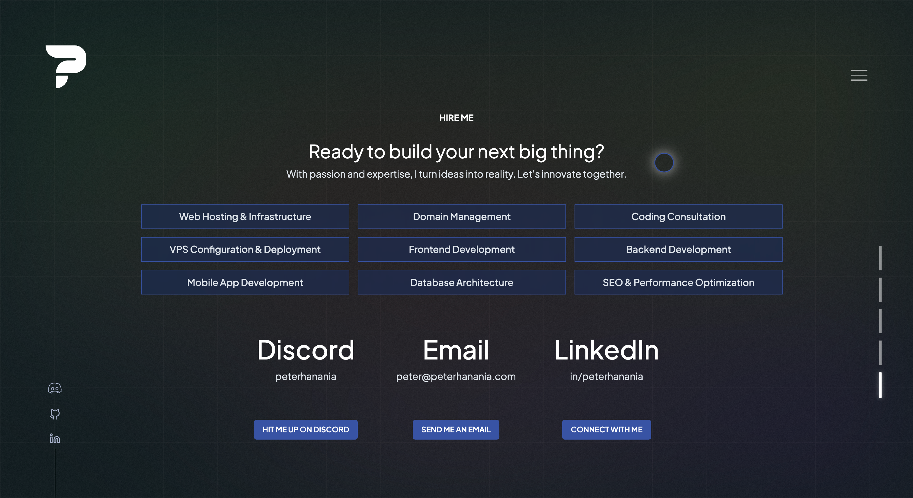

#  ⚡️ Ultimate Software Developer Portfolio

A blazing-fast, fully accessible personal portfolio built with **Astro + Preact**. Scores 100/100 on Lighthouse across Performance, Accessibility, SEO, and Best Practices.

**Live:** [peterhanania.com](https://peterhanania.com)

[](LICENSE)
[](https://github.com/peterhanania/portfolio/stargazers)
[](https://peterhanania.com)
[](https://peterhanania.com)
[](https://astro.build)
[](https://www.typescriptlang.org)

[](https://vercel.com/new/clone?repository-url=https://github.com/peterhanania/portfolio)
[](https://app.netlify.com/start/deploy?repository=https://github.com/peterhanania/portfolio)
[](https://render.com/deploy?repo=https://github.com/peterhanania/portfolio)

---

## Screenshots







---

## Why this exists

Most portfolio templates are either bloated React SPAs or static HTML with zero interactivity. This one ships **10kb of UI runtime** (Preact instead of React), scores a perfect Lighthouse, and still has silky animations, and 5 switchable color themes. Open-sourced so other devs can use it as a starting point.

---

## Features

- ✅ **Full-page scroll hijacking** — smooth per-section scrolling on desktop, native swipe on mobile, complete keyboard nav (arrows, spacebar, Page Up/Down, Home/End)
- ✅ **5 color themes** — Blue, Purple, Green, Orange, Black — persisted to `localStorage`
- ✅ **Custom cursor** — three-layer cursor with hover states, driven by `requestAnimationFrame` at 60fps
- ✅ **Text scramble animations** — Baffle.js with a `█▓▒░<>$%@` character set
- ✅ **Section gradients** — unique radial gradient backgrounds per section
- ✅ **Live Discord presence** — real-time status via [Lanyard](https://github.com/Phineas/lanyard)
- ✅ **PWA** — installable, service worker + Workbox caching strategy
- ✅ **100/100 Lighthouse** — Performance, Accessibility, SEO, Best Practices
- ✅ **Accessible** — ARIA labels, semantic HTML, `prefers-reduced-motion`, full keyboard navigation, proper focus management

---

## Tech Stack

| Layer | Tech |
|---|---|
| Framework | [Astro](https://astro.build) |
| UI | [Preact](https://preactjs.com) + `@preact/compat` |
| State | [Zustand](https://github.com/pmndrs/zustand) + `@preact/signals` |
| Animations | [Framer Motion](https://www.framer.com/motion/), [Lottie](https://airbnb.io/lottie/), [Baffle.js](https://camwiegert.github.io/baffle/), [canvas-confetti](https://github.com/catdad/canvas-confetti) |
| Monorepo | [Turborepo](https://turbo.build) + Yarn Workspaces |
| Deployment | Netlify |
| PWA | Vite PWA + Workbox |

Preact instead of React because there was no reason to ship 42kb when 10kb does the same thing.

---

## Getting Started

**Prerequisites:** Node.js 18+, Yarn

```bash
# Install dependencies
yarn install

# Start dev server
yarn dev

# Build for production
yarn build

# Preview production build
yarn preview
```

The dev server runs at `http://localhost:4321`.

---

## Project Structure

```
packages/
└── frontend/
    ├── src/
    │   ├── components/     # All UI sections and shared components
    │   ├── pages/          # Astro pages (index, 404)
    │   ├── layouts/        # Base HTML layout
    │   ├── constants.ts    # Sections, themes config
    │   ├── states.ts       # Zustand store
    │   └── helpers.ts      # Scroll, navigation, focus utilities
    ├── constants/
    │   └── technologies.tsx # 40+ tech icons with labels
    └── public/             # Static assets
```

---

## Using this as a template

Feel free to fork and adapt it. If you do, a GitHub star goes a long way. The main things you'd swap out:

1. Content in `src/components/` (hero copy, experience, projects)
2. `constants/technologies.tsx` for your own stack icons
3. Colors/gradients in the CSS custom properties

---

## License

MIT — do whatever you want with it.
